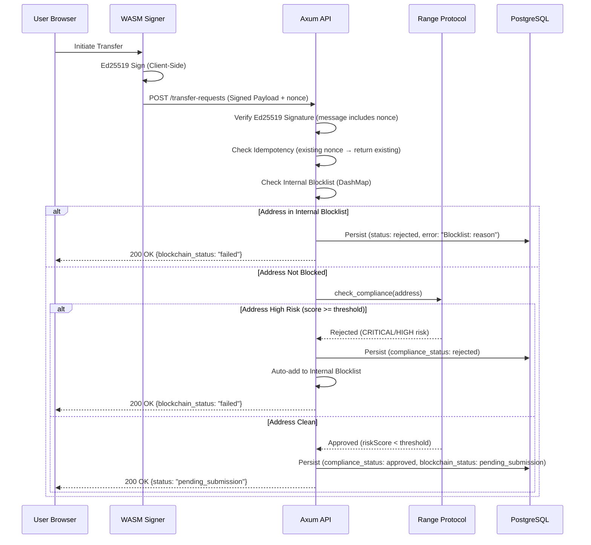
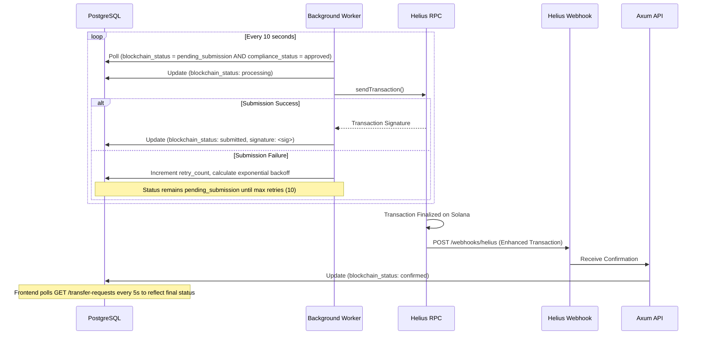

# Architecture

This document provides a technical deep dive into the Solana Compliance Relayer's architecture, directory structure, and data flow patterns.

---

## Hexagonal Architecture (Ports and Adapters)

The project implements **Hexagonal Architecture** to ensure clean separation between business logic and infrastructure concerns. This design enables:

- **Testability:** Core business logic is independent of external systems
- **Flexibility:** Swap RPC providers, databases, or compliance APIs without changing core logic
- **Maintainability:** Clear boundaries between layers prevent coupling

### Layer Overview

| Layer | Responsibility | Location |
|-------|----------------|----------|
| **Domain** | Core business types and trait definitions (Ports) | `src/domain/` |
| **Application** | Business logic orchestration (Use Cases) | `src/app/` |
| **API** | HTTP interface (Primary Adapter) | `src/api/` |
| **Infrastructure** | External integrations (Secondary Adapters) | `src/infra/` |

---

## High-Level Architecture Diagram

```
┌─────────────────────────────────────────────────────────────────────────┐
│                           FRONTEND (Next.js)                            │
│  ┌───────────────────┐    ┌──────────────────┐    ┌─────────────────┐   │
│  │   Terminal Panel  │    │  WASM Signer     │    │  Monitor Panel  │   │
│  │   (Transfer UI)   │──▶│  (Ed25519-dalek) │    │  (5s Polling)   │   │
│  └───────────────────┘    └────────┬─────────┘    └─────────────────┘   │
└────────────────────────────────────┼────────────────────────────────────┘
                                     │ Signed Request
                                     ▼
┌─────────────────────────────────────────────────────────────────────────┐
│                           BACKEND (Axum + Rust)                         │
│  ┌─────────────────────────────────────────────────────────────────┐    │
│  │                        API Layer                                │    │
│  │  POST /transfer-requests  │  GET /transfer-requests/{id}        │    │
│  │  POST /webhooks/helius    │  GET /health, /health/live, /ready  │    │
│  │  POST /risk-check         │  /admin/blocklist (CRUD)            │    │
│  └──────────────────────────────┬──────────────────────────────────┘    │
│                                 │                                       │
│  ┌──────────────────────────────▼──────────────────────────────────┐    │
│  │                      Application Layer                          │    │
│  │  ┌─────────────┐    ┌───────────────────┐   ┌──────────────────┐│    │
│  │  │ AppService  │──▶│ ComplianceProvider│──▶│ DatabaseClient   ││    │
│  │  └─────────────┘    │ (Range Protocol)  │   │ (PostgreSQL)     ││    │
│  │                     └───────────────────┘   └──────────────────┘│    │
│  └─────────────────────────────────────────────────────────────────┘    │
│                                 │                                       │
│  ┌──────────────────────────────▼──────────────────────────────────┐    │
│  │                    Infrastructure Layer                         │    │
│  │  ┌──────────────────┐   ┌───────────────────┐                   │    │
│  │  │ Background Worker│──▶│ BlockchainClient  │──▶ Helius RPC    │    │
│  │  │ (10s poll cycle) │   │ (Strategy Pattern)│                   │    │
│  │  └──────────────────┘   └───────────────────┘                   │    │
│  └─────────────────────────────────────────────────────────────────┘    │
└─────────────────────────────────────────────────────────────────────────┘
```

---

## Directory Structure

```
src/
├── domain/          # Core business types and trait definitions (Ports)
│   ├── types.rs     # TransferRequest, ComplianceStatus, BlockchainStatus
│   ├── traits.rs    # DatabaseClient, BlockchainClient, ComplianceProvider
│   └── error.rs     # Unified error types
├── app/             # Application layer (Use Cases)
│   ├── service.rs   # Business logic orchestration
│   ├── state.rs     # AppState (service, blocklist, risk_service, etc.)
│   ├── risk_service.rs  # Pre-flight risk check (blocklist + Range + DAS)
│   └── worker.rs    # Background retry worker with exponential backoff
├── api/             # HTTP interface (Primary Adapter)
│   ├── handlers.rs  # Axum route handlers with OpenAPI docs
│   ├── admin.rs     # Admin API for blocklist management
│   └── router.rs    # Rate limiting, CORS, middleware
└── infra/           # External integrations (Secondary Adapters)
    ├── database/    # PostgreSQL via SQLx (compile-time checked)
    ├── blockchain/  # Solana via Helius/QuickNode/Standard RPC (strategies)
    ├── blocklist/   # Internal blocklist with DashMap + PostgreSQL
    ├── compliance/  # Range Protocol integration
    └── privacy/     # QuickNode Privacy Health Check (confidential transfers)
```

---

## Data Flow Diagrams

The transaction flow is split into two phases for clarity.

### Phase 1: Submission Flow

This diagram covers the request journey from user initiation through compliance checks to database persistence.



### Phase 2: Execution & Finalization Flow

This diagram covers the background worker processing, blockchain submission, and webhook confirmation.



---

## Transaction Lifecycle States

Transactions progress through the following states:

```
┌─────────┐    ┌───────────────────┐    ┌────────────┐    ┌───────────┐    ┌───────────┐
│ Pending │──▶│ PendingSubmission │───▶│ Processing │──▶│ Submitted │───▶│ Confirmed │
└─────────┘    └───────────────────┘    └────────────┘    └───────────┘    └───────────┘
                        │                      │                                  │
                        │                      │                                  │
                        ▼                      ▼                                  │
                   ┌──────────┐           ┌─────────┐                             │
                   │  Failed  │◀─────────│  Retry  │◀────────────────────────────┘
                   │(10 tries)│           │(backoff)│    (if webhook reports error)
                   └──────────┘           └─────────┘
```

| Status | Trigger | Next State |
|--------|---------|------------|
| `pending` | Initial creation | → `pending_submission` (after compliance check) |
| `pending_submission` | Compliance approved, queued for worker | → `processing` |
| `processing` | Worker claimed task | → `submitted` (success) or retry (failure) |
| `submitted` | Transaction propagated to Solana | → `confirmed` (via webhook) |
| `confirmed` | Helius webhook confirms finalization | Terminal state |
| `failed` | Max retries (10) exceeded | Terminal state |

---

## Key Design Patterns

### Strategy Pattern (Blockchain Client)

The relayer auto-detects the RPC provider and activates appropriate features:

| Provider | Detection | Features |
|----------|-----------|----------|
| **Helius** | URL contains `helius-rpc.com` | Priority fees, DAS, Enhanced Webhooks |
| **QuickNode** | URL contains `quiknode.pro` | Priority fees, Privacy Health, Jito Bundles |
| **Standard** | Any other RPC | Static fallback fee strategy |

### Outbox Pattern (Transaction Persistence)

All approved transactions are persisted to PostgreSQL before blockchain submission. This ensures:

- No approved transaction is ever lost
- Automatic retry on network failures
- Complete audit trail

### Port/Adapter Pattern

Business logic depends only on trait definitions (ports). Infrastructure implementations (adapters) are injected at startup, enabling:

- Easy testing with mock implementations
- Provider swaps without code changes
- Clear dependency boundaries
