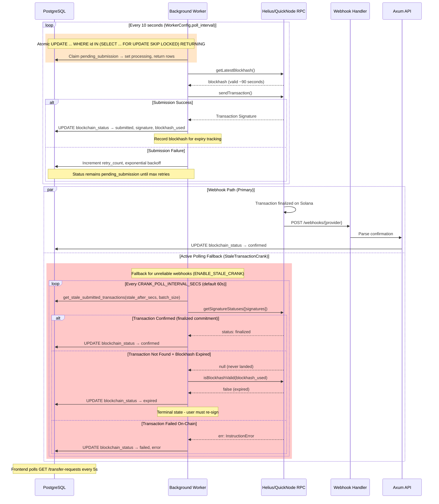

# Architecture

Technical deep dive into the Solana Compliance Relayer's enterprise-grade architecture, data flow patterns, and reliability mechanisms.

---

## Table of Contents

- [Hexagonal Architecture](#hexagonal-architecture-ports-and-adapters)
- [High-Level Architecture Diagram](#high-level-architecture-diagram)
- [Directory Structure](#directory-structure)
- [Data Flow Diagrams](#data-flow-diagrams)
- [Transaction Lifecycle States](#transaction-lifecycle-states)
- [Enterprise Reliability Patterns](#enterprise-reliability-patterns)
- [Configuration & Provider Strategy](#configuration--provider-strategy)

---

## Hexagonal Architecture (Ports and Adapters)

The project implements **Hexagonal Architecture** to ensure clean separation between business logic and infrastructure concerns:

- **Testability:** Core business logic is independent of external systems
- **Flexibility:** Swap RPC providers, databases, or compliance APIs without changing core logic
- **Maintainability:** Clear boundaries between layers prevent coupling

### Layer Overview

| Layer | Responsibility | Location |
|-------|----------------|----------|
| **Domain** | Core business types and trait definitions (Ports) | `src/domain/` |
| **Application** | Business logic orchestration (Use Cases) | `src/app/` |
| **API** | HTTP interface (Primary Adapter) | `src/api/` |
| **Infrastructure** | External integrations (Secondary Adapters) | `src/infra/` |

---

## High-Level Architecture Diagram

```
┌─────────────────────────────────────────────────────────────────────────┐
│                           FRONTEND (Next.js)                            │
│  ┌───────────────────┐    ┌──────────────────┐    ┌─────────────────┐   │
│  │   Terminal Panel  │    │  WASM Signer     │    │  Monitor Panel  │   │
│  │   (Transfer UI)   │──▶│  (Ed25519-dalek) │    │  (5s Polling)   │   │
│  └───────────────────┘    └────────┬─────────┘    └─────────────────┘   │
└────────────────────────────────────┼────────────────────────────────────┘
                                     │ Signed Request
                                     ▼
┌─────────────────────────────────────────────────────────────────────────┐
│                           BACKEND (Axum + Rust)                         │
│  ┌─────────────────────────────────────────────────────────────────┐    │
│  │                        API Layer                                │    │
│  │  POST /transfer-requests  │  GET /transfer-requests/{id}        │    │
│  │  POST /webhooks/helius    │  GET /health, /health/live, /ready  │    │
│  │  POST /risk-check         │  /admin/blocklist (CRUD)            │    │
│  └──────────────────────────────┬──────────────────────────────────┘    │
│                                 │                                       │
│  ┌──────────────────────────────▼──────────────────────────────────┐    │
│  │                      Application Layer                          │    │
│  │  ┌─────────────┐    ┌───────────────────┐   ┌──────────────────┐│    │
│  │  │ AppService  │──▶│ ComplianceProvider│──▶│ DatabaseClient   ││    │
│  │  └─────────────┘    │ (Range Protocol)  │   │ (PostgreSQL)     ││    │
│  │                     └───────────────────┘   └──────────────────┘│    │
│  └─────────────────────────────────────────────────────────────────┘    │
│                                 │                                       │
│  ┌──────────────────────────────▼──────────────────────────────────┐    │
│  │                    Infrastructure Layer                         │    │
│  │  ┌──────────────────┐   ┌───────────────────┐                   │    │
│  │  │ Background Worker│──▶│ BlockchainClient  │──▶ Helius/QN RPC │    │
│  │  │ (Atomic claim    │   │ (URL-detected     │                   │    │
│  │  │  SKIP LOCKED)    │   │  provider)        │                   │    │
│  │  └──────────────────┘   └───────────────────┘                   │    │
│  └─────────────────────────────────────────────────────────────────┘    │
└─────────────────────────────────────────────────────────────────────────┘
```

---

## Directory Structure

```
src/
├── domain/          # Core business types and trait definitions (Ports)
│   ├── mod.rs       # Re-exports
│   ├── types.rs     # TransferRequest, ComplianceStatus, BlockchainStatus, LastErrorType
│   ├── traits.rs    # DatabaseClient, BlockchainClient, ComplianceProvider
│   └── error.rs     # Unified error types
├── app/             # Application layer (Use Cases)
│   ├── mod.rs       # Re-exports
│   ├── service.rs   # Business logic orchestration
│   ├── state.rs     # AppState (service, blocklist, risk_service, webhook secrets)
│   ├── risk_service.rs  # Pre-flight risk check (blocklist + Range + DAS)
│   └── worker.rs    # Background worker (SKIP LOCKED) + StaleTransactionCrank
├── api/             # HTTP interface (Primary Adapter)
│   ├── mod.rs       # Re-exports
│   ├── handlers.rs  # Axum route handlers with OpenAPI docs
│   ├── admin.rs     # Admin API for blocklist management
│   └── router.rs    # Rate limiting, CORS, middleware
├── infra/           # External integrations (Secondary Adapters)
│   ├── mod.rs       # Re-exports
│   ├── database/    # PostgreSQL via SQLx (postgres.rs)
│   ├── blockchain/  # Helius, QuickNode, solana.rs, strategies (RpcProviderType)
│   ├── blocklist/   # Internal blocklist with PostgreSQL
│   ├── compliance/  # Range Protocol (range.rs)
│   └── privacy/     # QuickNode Privacy Health Check (confidential transfers)
├── main.rs          # Entry point, wiring
└── lib.rs           # Crate root
```

---

## Data Flow Diagrams

The transaction flow is split into two phases for clarity.

### Phase 1: Submission Flow (Receive → Persist → Process)

> **Design Principle:** Persist BEFORE compliance processing to ensure 100% auditability. If the service crashes mid-check, the record exists for recovery.


### Phase 2: Execution & Finalization Flow (with Active Polling Fallback)

> **Design Principle:** Webhooks are not 100% reliable. The system self-heals via active polling (cranks) for transactions stuck in `submitted` state.



---

## Transaction Lifecycle States

Transactions progress through the following states, with explicit handling for **blockhash expiry**:

```
┌──────────┐    ┌───────────────────┐     ┌────────────┐     ┌───────────┐    ┌───────────┐
│ Received │───▶│ PendingSubmission │───▶│ Processing │───▶│ Submitted │───▶│ Confirmed │
└──────────┘    └───────────────────┘     └────────────┘     └───────────┘    └───────────┘
     │                   │                      │                │                 
     │                   │                      │                │ (blockhash expired,
     ▼                   ▼                      ▼                │  tx not found)
┌──────────┐       ┌──────────┐           ┌─────────┐            │
│ Rejected │       │  Failed  │◀──────────│  Retry  │            ▼
│(blocklist│       │(10 tries │           │(backoff)│       ┌─────────┐
│ or Range)│       │ exceeded)│           └─────────┘       │ Expired │
└──────────┘       └──────────┘                             └─────────┘
                                                            (Terminal - 
                                                             re-sign required)
```

### State Transition Table

| Status | Trigger | Next State |
|--------|---------|------------|
| `received` | Initial persistence (before compliance check) | → `rejected` or `pending_submission` |
| `pending` | *(Legacy)* Alias for `received` in older DB rows | Same as `received` |
| `pending_submission` | Compliance approved, queued for worker | → `processing` |
| `processing` | Worker claimed task via UPDATE...FOR UPDATE SKIP LOCKED RETURNING | → `submitted` (success) or retry (failure) |
| `submitted` | Transaction sent to Solana | → `confirmed` (webhook/crank) or `expired` (blockhash expired) |
| `confirmed` | Finalized commitment received | **Terminal state** |
| `expired` | Blockhash expired + tx not found | **Terminal state** (user must re-sign) |
| `failed` | Max retries (10) exceeded | **Terminal state** |

States are defined in `src/domain/types.rs` as the `BlockchainStatus` enum (`as_str()` yields the values above).

### Blockhash Expiry Handling

> **Solana Constraint:** A transaction signature is only valid for the blockhash it was built with. Blockhashes expire after ~60-90 seconds (~150 slots).

**Retry Safety Logic:**

1. **Transaction Found + Confirmed:** Update to `confirmed` (success).
2. **Transaction Found + Failed:** Update to `failed` with on-chain error.
3. **Transaction NOT Found + Blockhash Still Valid:** Wait and poll again.
4. **Transaction NOT Found + Blockhash EXPIRED:** Safe to mark as `expired`.
   - The original signature can never land; user must submit a new signed request.

---

## Enterprise Reliability Patterns

### 1. Receive → Persist → Process Pattern

**Problem:** Checking compliance before persisting loses records if the service crashes mid-check.

**Solution:** Immediately persist with status `received`, then run compliance and update. Implemented in `src/app/service.rs` (submit_transfer) and `src/infra/database/postgres.rs` (submit_transfer uses `BlockchainStatus::Received.as_str()`).

```sql
-- Step 1: Immediate persist (API handler via db_client.submit_transfer)
-- Uses ON CONFLICT (nonce) WHERE nonce IS NOT NULL for idempotency.
INSERT INTO transfer_requests (
    id, from_address, to_address, ..., compliance_status, blockchain_status, ...
) VALUES ($1, $2, $3, ..., 'pending', 'received', ...)  -- compliance_status, blockchain_status
ON CONFLICT (nonce) WHERE nonce IS NOT NULL DO UPDATE SET id = transfer_requests.id
RETURNING ...;

-- Step 2: Update after compliance (same handler, AppService)
UPDATE transfer_requests 
SET compliance_status = 'approved', 
    blockchain_status = 'pending_submission'
WHERE id = $1;
```

### 2. UPDATE ... WHERE id IN (SELECT ... FOR UPDATE SKIP LOCKED) RETURNING

**Problem:** Multiple Kubernetes pods polling the same table race to process the same transaction, causing double-submissions.

**Solution:** Atomic claim via an **UPDATE** that selects eligible rows with `FOR UPDATE SKIP LOCKED`, then returns the updated rows in one round-trip (`src/infra/database/postgres.rs`):

```sql
UPDATE transfer_requests
SET blockchain_status = 'processing',
    updated_at = NOW()
WHERE id IN (
    SELECT id FROM transfer_requests
    WHERE blockchain_status = 'pending_submission'
      AND compliance_status = 'approved'
      AND (blockchain_next_retry_at IS NULL OR blockchain_next_retry_at <= $1)
      AND blockchain_retry_count < 10
    ORDER BY blockchain_next_retry_at ASC NULLS FIRST, created_at ASC
    LIMIT $2
    FOR UPDATE SKIP LOCKED
)
RETURNING id, from_address, to_address, ...;
```

This guarantees:
- Each row is processed by exactly one worker
- Workers don't block each other (SKIP vs. wait)
- Claimed rows are updated to `processing` and returned in a single atomic operation

### 3. Active Polling Fallback (Stale Transaction Crank)

**Problem:** Webhooks may fail due to network issues, provider outages, or delivery delays.

**Solution:** A separate **StaleTransactionCrank** (`src/app/worker.rs`) runs on a configurable interval (default 60s) and calls `get_stale_submitted_transactions(older_than_secs, limit)`. The database query (`src/infra/database/postgres.rs`) selects rows where `blockchain_status = 'submitted'` and `updated_at < NOW() - make_interval(secs => $1)` (default 90 seconds). The service then calls `get_signature_status` and `is_blockhash_valid` per transaction:

```rust
// Simplified flow (AppService::process_stale_submitted_transactions)
let stale = db_client.get_stale_submitted_transactions(older_than_secs, batch_size).await?;
for tx in stale {
    match blockchain_client.get_signature_status(&tx.blockchain_signature).await? {
        Some(Confirmed | Finalized) => db.update_blockchain_status(id, Confirmed, ...).await?,
        Some(Failed(err)) => db.update_blockchain_status(id, Failed, ..., err).await?,
        None => {
            if !blockchain_client.is_blockhash_valid(&tx.blockhash_used).await? {
                db.update_blockchain_status(id, Expired, ...).await?;
            }
            // else: blockhash still valid, wait for next crank cycle
        }
    }
}
```

**Configuration:** `ENABLE_STALE_CRANK`, `CRANK_POLL_INTERVAL_SECS` (default 60), `CRANK_STALE_AFTER_SECS` (default 90), `CRANK_BATCH_SIZE` (default 20).

### 4. Commitment Level: Finalized

The relayer waits for **`finalized` commitment** (99.9% certainty) before marking transactions complete:

| Commitment | Certainty | Use Case |
|------------|-----------|----------|
| `processed` | ~50% | Not safe for compliance |
| `confirmed` | ~95% | Faster but can rollback |
| **`finalized`** | ~99.9% | **Required for compliance audit** |

All `getSignatureStatuses` and webhook processing verify `confirmationStatus == "finalized"`.

---

## Configuration & Provider Strategy

### URL-Driven Provider Detection

> **Implementation:** RPC provider type is **detected from `SOLANA_RPC_URL`** at client build time (`src/infra/blockchain/strategies.rs`). There is no `RPC_PROVIDER_TYPE` environment variable. The URL is matched as follows:
> - **Helius:** URL contains `helius-rpc.com` or `helius.xyz`
> - **QuickNode:** URL contains `quiknode.pro` or `quicknode.com`
> - **Standard:** Any other URL (e.g. `api.mainnet-beta.solana.com`, custom RPC)

| Variable | Description | Values |
|----------|-------------|--------|
| `SOLANA_RPC_URL` | RPC endpoint URL; **also drives provider detection** | Helius/QuickNode URLs → premium features; else Standard |
| `USE_JITO_BUNDLES` | Enable Jito bundle submission (QuickNode only) | `true`, `false` |
| `JITO_TIP_LAMPORTS` | Tip amount for Jito bundles | e.g. `10000` |
| `JITO_REGION` | Optional Jito region (e.g. `ny`, `amsterdam`) | Optional |

### Provider Feature Matrix

| Feature | Helius | QuickNode | Standard |
|---------|--------|-----------|----------|
| Priority Fee Estimation | ✅ `getPriorityFeeEstimate` | ✅ `qn_estimatePriorityFees` | ❌ Static fallback |
| Asset Compliance (DAS) | ✅ `getAssetsByOwner` | ❌ | ❌ |
| Enhanced Webhooks | ✅ | ❌ | ❌ |
| Jito Bundles | ✅ (via Jito) | ✅ (via Jito) | ❌ |
| Privacy Health | ❌ | ✅ `qn_privacy_*` | ❌ |

### Port/Adapter Pattern

Business logic depends only on trait definitions (ports) in `src/domain/traits.rs`. Infrastructure implementations (adapters) are constructed in `main.rs` and passed into `AppState`. The **blockchain client** is a single `RpcBlockchainClient` that internally detects provider type from `SOLANA_RPC_URL` and selects fee strategy, submission strategy, and optional Jito bundle submission:

```rust
// Trait (Port) - src/domain/traits.rs
#[async_trait]
pub trait BlockchainClient: Send + Sync {
    async fn submit_transaction(&self, request: &TransferRequest) -> Result<(String, String), AppError>;
    async fn get_signature_status(&self, sig: &str) -> Result<Option<TransactionStatus>, AppError>;
    async fn is_blockhash_valid(&self, blockhash: &str) -> Result<bool, AppError>;
    // ... health_check, check_wallet_assets, etc.
}

// Adapter construction - main.rs uses RpcBlockchainClient::with_defaults_and_submission_strategy().
// Provider type is detected from config.blockchain_rpc_url via RpcProviderType::detect(url).
// No separate RPC_PROVIDER_TYPE env var; URL drives Helius vs QuickNode vs Standard behavior.
let provider_type = RpcProviderType::detect(&config.blockchain_rpc_url);
let blockchain_client = RpcBlockchainClient::with_defaults_and_submission_strategy(
    &config.blockchain_rpc_url,
    config.signing_key,
    submission_strategy,  // Optional Jito when USE_JITO_BUNDLES and QuickNode
    jito_tip_for_client,
)?;
```

This enables:
- Easy testing with mock implementations (`test_utils/mocks.rs`)
- Provider behavior derived from URL without a separate config key
- Clear dependency boundaries (domain traits, infra implementations)
